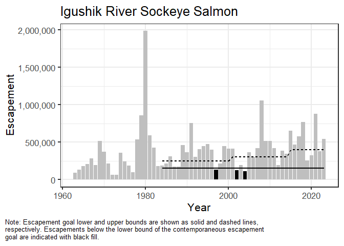
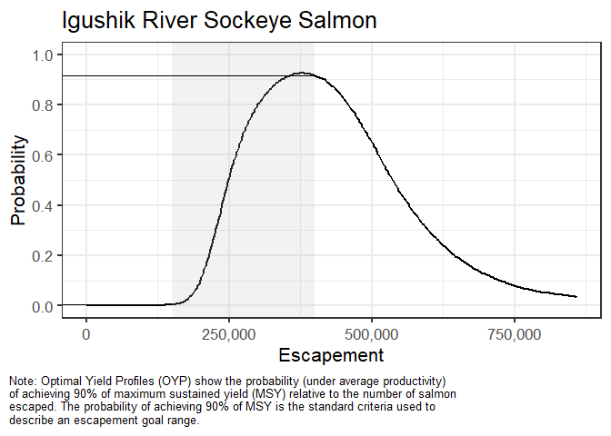
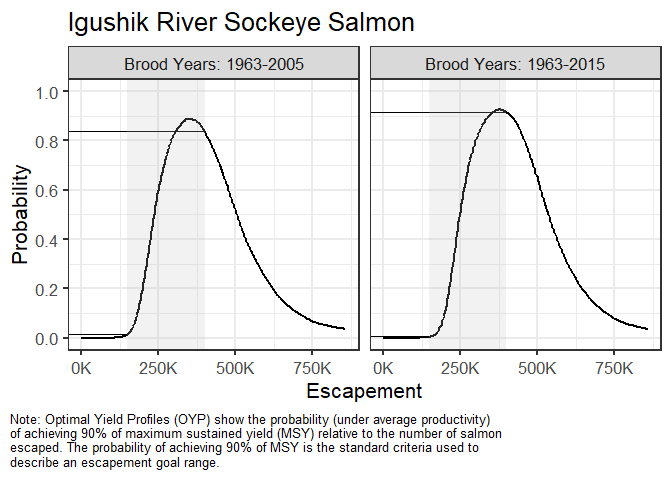
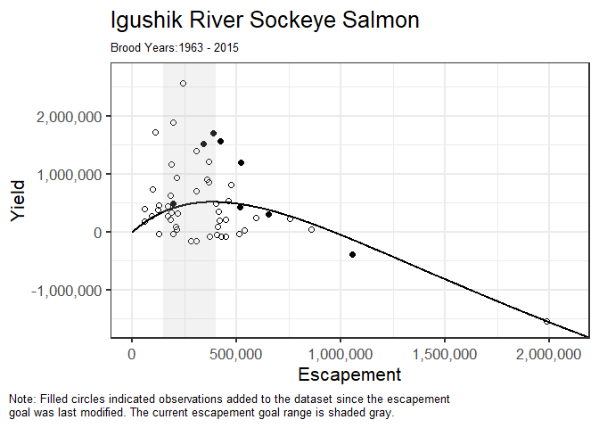
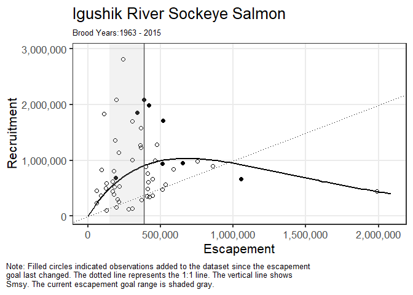
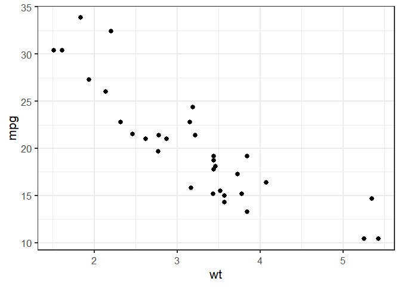

<!-- README.md is generated from README.Rmd. Please edit that file -->

# EGprocess

<!-- badges: start -->

<!-- badges: end -->

The R package EGprocess facilitates simple and standard creation of
escapement goal data reporting.

## Package Installation

You can install the development version of EGprocess from
[GitHub](https://github.com/) with:

``` r
# install.packages("pak")
pak::pak("adamreimer/EGprocess")
```

## Overview

EGprocess provides a standardized set of R functions to be used by ADF&G
staff during the escapement goal review process. This package is
designed to help staff from both fisheries divisions and all regions
produce consistent, high-quality figures and tables to be used as part
of the Board of Fisheries (BOF) meetings. Salmon escapement goals in
Alaska are reviewed every three years, aligned with the BOF’s regulatory
meeting cycle. EGprocess supports this work by creating standardized
outputs for spawner-recruit analyses, posterior summaries, expected
yield curves, optimal yield profiles (OYP), and comparisons among
updated and historical escapement goal findings. EGprocess can be used
directly in R, or as a downstream companion to the Pacific Salmon SR
Escapement Goal Analysis Shiny Application (“Hamachan Shiny App”), which
produces the input data structures used by the package.

### Why Standardize Figures?

Standardizing figure structure, captions, and themes reduces the
cognitive load on reviewers, allowing them to focus on interpretation
instead of formatting differences across regions or divisions. EGprocess
ensures:  
- Consistent plot titles (Stock Name + Species Name).  
- Standardized layout, theming, and color schema.  
- Concise, reproducible figure notes that act as built-in legends.  
- Reproducible workflows for future users and archiving.

Standardization does not prevent customization. Staff can treat
EGprocess outputs as templates, modifying elements as needed for unique
stock-specific situations. In more complex cases, users can build new
plots from scratch using the tools provided by EGprocess.

### Package Structure / Workflow

EGprocess starts with MCMC output data created either by the Hamachan
Shiny App, or during personalized spawner-recruit analyses using rJAGS.
Specifically, the posterior data must contain nodes of lnalpha, beta,
phi, and sigma.  
There are repeated elements within EGprocess for ease of use. Common
data inputs include:  
- *brood_data*: Brood table created by function `make_brood()`  
- *goal_data*: Current and historical escapement goals  
- *posterior_data*: MCMC samples for ln(alpha), beta, sigma, and related
parameters  
- *profile_data*: Data output from function `get_profile()`

### Flexible MSY Targets

While the typical escapement goal benchmark is 90% of MSY, it may be
necessary to demonstrate other MSY levels. For example, the included
dataset for Igushik River sockeye salmon shows a a near-zero probability
of achieving 90% MSY at the lower bound of its existing goal and
historical management reasoning for a suboptimal but stable yield.  
In cases like this, EGprocess supports side-by-side evaluation of
optimal and suboptimal yields. Users can specify a suboptimal target
directly in the `get_profile()` function and generate profile plots that
evaluate escapement goals relative to both targets.

### Updating Escapement Goals

Most frequently, researchers are tasked with updating an existing
escapement goal with additional returns. In such cases, it is helpful to
compare data since the previous assessment to the updated dataset.
EGprocess facilitates simple comparison between such datasets so that
researchers can assess the validity of the goal in light of additional
data. The plotting function `plot_profile_facet()` shows the Optimal
Yield Profile from both datasets.

## Function Overview

### get_profile()

Function `get_profile()` generates optimal yield profiles (OYP) and
expected yield curves from posterior MCMC samples.

``` r
get_profile(posterior_data = post_Igushik_byr63_15, multiplier = 1e-5)
#> # A tibble: 1,001 × 4
#>         s OYP90     SY   S.msy
#>     <dbl> <dbl>  <dbl>   <dbl>
#>  1     0      0     0  381647.
#>  2  2290.     0  7137. 381647.
#>  3  4580.     0 14211. 381647.
#>  4  6870.     0 21209. 381647.
#>  5  9160.     0 28150. 381647.
#>  6 11449.     0 35021. 381647.
#>  7 13739.     0 41814. 381647.
#>  8 16029.     0 48566. 381647.
#>  9 18319.     0 55244. 381647.
#> 10 20609.     0 61901. 381647.
#> # ℹ 991 more rows
```

### make_age()

Function `make_age()` creates age-composition proportions (A3, A4, etc)
from run data for use in brood‑table construction.

``` r
age_demo <- make_age(age_data = data_Igushik, min_age = 3, max_age = 8) 
head(age_demo)
#>              A3         A4        A5         A6 A7 A8
#> X1 0.0000000000 0.55576417 0.3766676 0.06756826  0  0
#> X2 0.0000000000 0.21937253 0.7100296 0.07059784  0  0
#> X3 0.0000000000 0.09571612 0.8498052 0.05447866  0  0
#> X4 0.0000000000 0.05698889 0.8474545 0.09555660  0  0
#> X5 0.0002546232 0.47735793 0.4993162 0.02307129  0  0
#> X6 0.0010286048 0.43029740 0.5496121 0.01906187  0  0
```

### make_brood()

Function `make_brood()` builds the brood table by combining escapement,
recruitment, and age-composition information.

``` r
brood_demo <- make_brood(data = data_Igushik, p = age_demo)
tail(brood_demo, n = 10)
#>      yr      S b.Age3  b.Age4  b.Age5 b.Age6 b.Age7 b.Age8       R
#> 60 2014 340590   1766  734904 1120532      2      0      0 1857204
#> 61 2015 651172      0  233250  655310  65390      0      0  953950
#> 62 2016 469230    851  555165  943585  10867      0     NA      NA
#> 63 2017 578700   2073 1014244 2310253  29350     NA     NA      NA
#> 64 2018 770772      0  664431 1046811     NA     NA     NA      NA
#> 65 2019 256074    668  303697      NA     NA     NA     NA      NA
#> 66 2020 323814      0      NA      NA     NA     NA     NA      NA
#> 67 2021 878952     NA      NA      NA     NA     NA     NA      NA
#> 68 2022 378768     NA      NA      NA     NA     NA     NA      NA
#> 69 2023 542496     NA      NA      NA     NA     NA     NA      NA
```

### plot_escapement()

Function `plot_escapement()` creates a plot of the historical
escapements, overlaid with the escapement goal history.

``` r
plot_escapement(brood_data = brood_demo, goal_data = goal_Igushik, 
                title = "Igushik River Sockeye Salmon")
```



### plot_profile()

Function `plot_profile()` generates a standardized Optimal Yield Profile
(OYP) plot from a single profile dataset.

``` r
Igushik_profile <- get_profile(post_Igushik_byr63_15, multiplier = 1e-5)
plot_profile(profile_data = Igushik_profile, goal_data = goal_Igushik, 
             title = "Igushik River Sockeye Salmon")
```



### plot_profile_facet()

Function `plot_profile_facet()` produces faceted OYP plots for comparing
multiple posterior datasets (e.g., updated vs. historical).

``` r
post_list <- list(
     'Brood Years: 1963-2005' = post_Igushik_byr63_05,
     'Brood Years: 1963-2015' = post_Igushik_byr63_15)
profile_list <- lapply(post_list, get_profile, multiplier = 1e-5)

plot_profile_facet(profile_data = profile_list, goal_data = goal_Igushik, 
                   title = "Igushik River Sockeye Salmon", labelK = TRUE)
```



### plot_ey()

Function `plot_ey()` produces an expected yield plot with an overlay of
the SR curve and the goal range.

``` r
plot_ey(profile_data = Igushik_profile, brood_data = brood_demo,
        goal_data = goal_Igushik, title = "Igushik River Sockeye Salmon")
```



### plot_SR()

Function `plot_SR()` produces an SR plot with an overlay of
S<sub>MSY</sub> and the goal range.

``` r
plot_SR(posterior_data = post_Igushik_byr63_15, brood_data = brood_demo,
        goal_data = goal_Igushik, title = "Igushik River Sockeye Salmon", 
        multiplier = 1e-5)
```



### theme_eg()

Function `theme_eg()` is the default escapement goal ggplot theme.

``` r
library(ggplot2)
ggplot(mtcars, aes(wt, mpg)) + 
  geom_point() + 
  theme_eg()
```



### table_SR()

Function `table_SR()` creates a table of SR parameters with confidence
intervals.

``` r
# NOT WORKING
#table_SR(profile_data = post_Igushik_byr63_15, multiplier = 1e-5)
```

### output_SR()

Function `output_SR()` is the final function in the workflow. It creates
a list containing all the escapement goal figures and tables. Output is
not shown here because it contains all previous examples.

## Included Datasets

To help users and produce useful examples, EGprocess includes 4 example
datasets from Igushik River sockeye salmon escapement goal analyses.  
Dataset `goal_Igushik` provides the historical escapement goal bounds
used across management periods, while dataset`data_Igushik` contains
annual escapement, total run, and age‑composition information used to
build brood tables.  
Two posterior datasets, `post_Igushik_byr63_05` and
`post_Igushik_byr63_15`, contain MCMC samples of model parameters for
brood years 1963–2005 and 1963–2015, respectively.  
More information about the included datasets are found in the
[supporting data docs](../../R/data-docs.R) and in the included
[vignette
Escapement-Goal-Figures](./vignettes/Escapement-Goal-Figures.Rmd).
